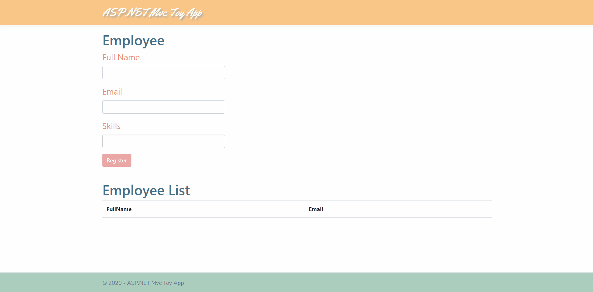

# ASP.NET core MVC + EF toy app
> A simple employee web form to demonstrate CRUD operations

## Live demo

[https://aspmvctoyapp.azurewebsites.net/](https://aspmvctoyapp.azurewebsites.net/)

## Dependencies

* Server Side
    * [Microsoft.EntityFrameworkCore.SqlServer](https://www.nuget.org/packages/Microsoft.EntityFrameworkCore.SqlServer/)
    * [Microsoft.EntityFrameworkCore.Tools](https://www.nuget.org/packages/Microsoft.EntityFrameworkCore.Tools/)
* Client Side
    * [bootstrap-tagsinput](https://github.com/bootstrap-tagsinput/bootstrap-tagsinput)
    * [typeahead.js](https://github.com/twitter/typeahead.js)

## Resources
* Videos
    * [C# 101](https://www.youtube.com/playlist?list=PLdo4fOcmZ0oVxKLQCHpiUWun7vlJJvUiN)
    * [.NET Core 101](https://dotnet.microsoft.com/learn/dotnet/hello-world-tutorial/intro)
    * [ASP.NET Core 101](https://dotnet.microsoft.com/learn/aspnet/hello-world-tutorial/intro)
    * [Entity Framework Core 101](https://channel9.msdn.com/Series/Entity-Framework-Core-101)

* [Tutorial ASP.NET MVC EF](https://docs.microsoft.com/en-us/aspnet/core/tutorials/first-mvc-app/?view=aspnetcore-3.1)

* [ASP.NET core docs](https://docs.microsoft.com/en-us/aspnet/core/fundamentals/?view=aspnetcore-3.1)

* [LINQ docs](https://docs.microsoft.com/en-us/dotnet/standard/using-linq)

* [Razor docs](https://docs.microsoft.com/en-us/aspnet/core/mvc/views/razor?view=aspnetcore-3.1)

* [Entity Framework core docs](https://docs.microsoft.com/en-us/ef/core/)

* [Azure deploy to an App Service on Linux](https://docs.microsoft.com/en-us/azure/app-service/containers/tutorial-dotnetcore-sqldb-app)
